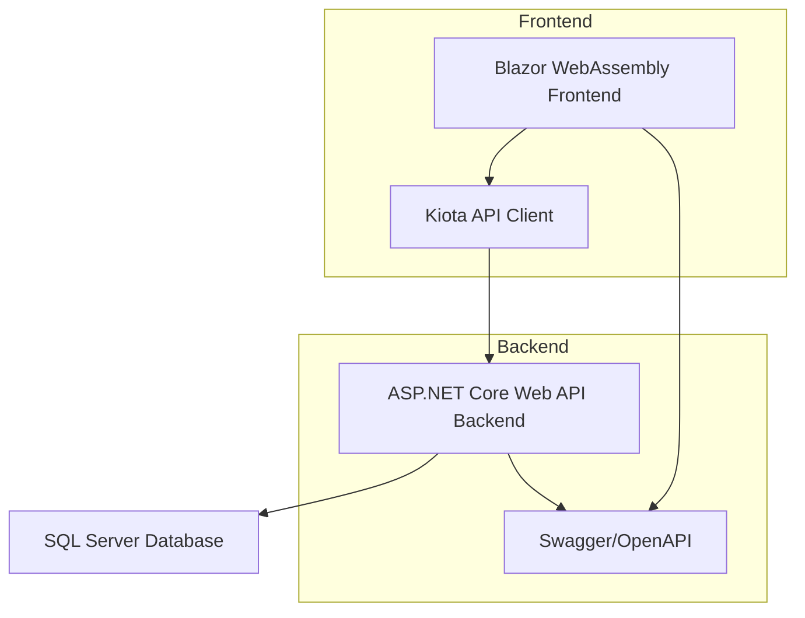

# Fuel Performance Testing

A full-stack application for managing player evaluations.

## Tech Stack

- ASP.NET Core 10.0 (Web API backend)
- Entity Framework Core (ORM, SQL Server database)
- Blazor WebAssembly (SPA frontend)
- Kiota (typed API client generation)
- SQL Server (database)
- PowerShell (database seeding/maintenance scripts)
- Swagger/OpenAPI (API documentation)

### What This Project Has Implemented So Far

- Built a full-stack .NET CRUD application:
  - `FuelApp` (ASP.NET Core Web API)
  - `FuelWebUi` (Blazor WebAssembly frontend)
- Implemented end-to-end CRUD workflows for all core entities:
  - Associations;
  - Teams;
  - Players;
  - Staff Members;
  - Evaluations.
- Used Entity Framework Core to map database records to C# domain models and support data access.
- Exposed an OpenAPI/Swagger API contract for documentation and client generation.
- Generated a typed frontend API client with Kiota.
- Added API middleware for cross-cutting concerns:
  - Built-in HTTP logging for request and response debugging;
  - Global exception handling;
  - Custom URL and body sanitization middleware (prototype-level; consider built-in or third-party alternatives for production).
- Built a functional Blazor frontend that consumes CRUD API endpoints.
- Implemented performance-focused optimizations:
  - Lightweight DTO projections to reduce payload size and unnecessary query data;
  - Server-side pagination to improve API response time and frontend rendering performance;
  - Database indexes on fields used for sorting and relationship lookups.
- Leveraged GitHub Copilot; now reviewing for mistakes. Example:
  - See file FuelPerformanceTesting\FuelApp\Repositories\Implementations\AssociationRepository.cs line 35;
  - Commented out Copilot version and showed what I observed to make it better.


### What Still Needs To Be Done

- Complete frontend functionality for evaluators to work offline and upload data later;
- Implement state management in the frontend;
- Add authentication and authorization with role-based access;
- Direct users to the appropriate frontend page based on their role;
- Add testing and address concurrency issues;
- Add more backend endpoints to support future frontend components.
- A lot more!


## Architecture Diagram




- **FuelApp** - ASP.NET Core Web API (Backend)
- **FuelWebUi** - Blazor WebAssembly (Frontend)


## Prerequisites

- [.NET 10.0 SDK](https://dotnet.microsoft.com/download/dotnet/10.0) (or later)
- A code editor (Visual Studio Code recommended)
- [SQL Server LocalDB](https://learn.microsoft.com/en-us/sql/database-engine/configure-windows/sql-server-express-localdb) or SQL Server instance


## Getting Started

### 1. Clone the Repository

```bash
git clone <repository-url>
cd FuelPerformanceTesting
```

### 2. Restore Dependencies

Restore NuGet packages for all projects.

```bash
dotnet restore .\FuelPerformanceTesting.sln
```

### 3. Build the Solution

Build both the backend and frontend.

```bash
dotnet build .\FuelPerformanceTesting.sln
```

### 4. Database Setup

The application uses Entity Framework Core with SQL Server.


**If you have SQL Server installed with Windows Authentication:** The connection string is already configured in `appsettings.Development.json` and requires no changes. Skip to "Apply Migrations" below.

**If using a named instance or SQL authentication:** Update the connection string in `FuelApp/appsettings.Development.json` as needed:

```json
{
  "ConnectionStrings": {
    "DefaultConnection": "Server=localhost\\SQLEXPRESS;Database=FuelAppDb;Trusted_Connection=True;TrustServerCertificate=True;"
  }
}
```


#### Install EF Core Tools (if not already installed)

```bash
dotnet tool install --global dotnet-ef
```


#### Apply Migrations

Navigate to the backend project and apply migrations:

```bash
cd FuelApp
dotnet ef database update
```


Or from the repo root:

```bash
dotnet ef database update --project .\FuelApp\FuelApp.csproj
```


This will create the `FuelAppDb` database and all required tables automatically.


### 5. Run the Application

You need to run both the backend API and the frontend UI.


#### Option 1: Two Terminals (Recommended for Development)

**Terminal 1 - Backend API:**
```bash
dotnet run --project .\FuelApp\FuelApp.csproj
```


The API will start at `http://localhost:5114` (or the port specified in `launchSettings.json`).

Swagger is available at `http://localhost:5114/swagger`.

**Terminal 2 - Frontend UI:**
```bash
dotnet run --project .\FuelWebUi\FuelWebUi.csproj
```


The UI will start at `http://localhost:5015` (or the port specified in `launchSettings.json`).

#### Option 2: Run from Project Directories

**Terminal 1:**
```bash
cd FuelApp
dotnet run
```

**Terminal 2:**
```bash
cd FuelWebUi
dotnet run
```


### 6. Seed the Database (Optional)

Once the backend is running, you can seed the database with test data using the PowerShell scripts in `DataBaseSeedScripts/`:

```bash
.\DataBaseSeedScripts\seed-database.ps1     # Seed test data
.\DataBaseSeedScripts\clean-database.ps1    # Clean/reset database
```


**Note:** Ensure the backend API is running before executing these scripts.


## Development Workflow

### Common Commands

#### Build
```bash
dotnet build .\FuelPerformanceTesting.sln
```

#### Clean Build Artifacts
```bash
dotnet clean .\FuelPerformanceTesting.sln
```

#### Add a new migration
```bash
dotnet ef migrations add <MigrationName> --project .\FuelApp\FuelApp.csproj
```


## Project Details

### Backend (FuelApp)

- **Framework:** ASP.NET Core Web API (.NET 10.0)
- **Database:** Entity Framework Core with SQL Server
- **Architecture:** Repository pattern with dependency injection.

Key folders:
- `Controllers/` - API endpoints;
- `Models/` - Entity models;
- `Repositories/` - Data access layer;
- `Data/` - DbContext and database configuration;
- `Migrations/` - EF Core migrations.

### Frontend (FuelWebUi)

- **Framework:** Blazor WebAssembly (.NET 10.0)
- **API Client:** Kiota-generated client
- **UI:** Component-based architecture.

Key folders:
- `Pages/` - Blazor pages/components;
- `Layout/` - App shell and navigation;
- `ApiClient/` - Generated API client;
- `wwwroot/` - Static assets.


## Configuration

### Backend API Settings

Edit `FuelApp/appsettings.Development.json`:

```json
{
  "ConnectionStrings": {
    "DefaultConnection": "Your SQL Server connection string"
  }
}
```

### Frontend API Endpoint

The frontend API client is configured to point to the backend. Update `FuelWebUi/Program.cs` if the backend URL changes.


## Troubleshooting

### Port Already in Use

If ports are in use, modify the URLs in:
- Backend: `FuelApp/Properties/launchSettings.json`;
- Frontend: `FuelWebUi/Properties/launchSettings.json`.

### Database Connection Issues

Verify your connection string in `appsettings.json` and ensure SQL Server is running.

### CORS Errors

Ensure the backend CORS policy allows requests from the frontend's origin.